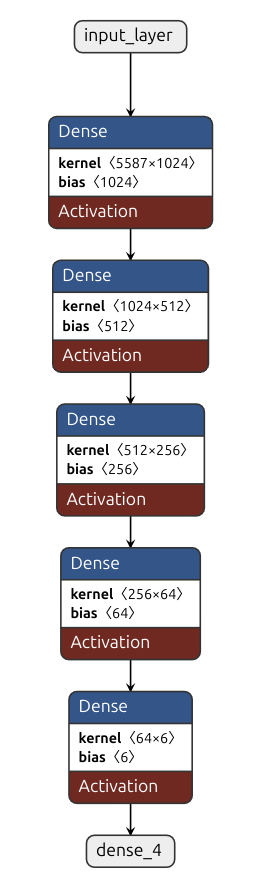

# Rede Neural Totalmente Conectada para Classificação de Emoções

## Visão Geral
Este projeto implementa uma rede neural totalmente conectada (FCNN) para classificação de emoções usando o Emotion Dataset do Hugging Face. O modelo classifica textos em seis categorias emocionais: tristeza, alegria, amor, raiva, medo e surpresa.

## 📑 Índice
- [Rede Neural Totalmente Conectada para Classificação de Emoções](#rede-neural-totalmente-conectada-para-classificação-de-emoções)
  - [Visão Geral](#visão-geral)
  - [📑 Índice](#-índice)
  - [📁 Estrutura do Projeto](#-estrutura-do-projeto)
  - [📊 Conjunto de Dados](#-conjunto-de-dados)
  - [🔍 Pré-processamento de Texto](#-pré-processamento-de-texto)
  - [🧠 Arquitetura do Modelo](#-arquitetura-do-modelo)
  - [⚙️ Detalhes do Treinamento](#️-detalhes-do-treinamento)
  - [🚀 Instalação](#-instalação)
    - [Pré-requisitos](#pré-requisitos)
    - [Passos](#passos)
  - [🛠️ Uso](#️-uso)
    - [📥 Preparação dos Dados](#-preparação-dos-dados)
    - [🏋️ Treinar o Modelo](#️-treinar-o-modelo)
    - [🔍 Testar o Modelo](#-testar-o-modelo)
  - [📈 Desempenho](#-desempenho)
  - [📋 Requisitos](#-requisitos)
  - [👥 Contribuindo](#-contribuindo)
  - [📄 Licença](#-licença)
  - [🙏 Agradecimentos](#-agradecimentos)

## 📁 Estrutura do Projeto
```
fully_connected_neural_network/
│
├── data/                  # Diretório de dados
│   ├── train_data.parquet # Dados de treinamento
│   ├── test_data.parquet  # Dados de teste
│   └── validation_data.parquet # Dados de validação
│
├── model/                 # Diretório de artefatos do modelo
│   ├── fcnn.keras         # Modelo Keras salvo
│   ├── label_encoder.joblib # Codificador de rótulos serializado
│   └── vectorizer.joblib  # Vetorizador TF-IDF serializado
│
├── utils/                 # Módulos utilitários
│   ├── __init__.py
│   ├── evaluate_and_save.py # Utilitários para avaliação e salvamento do modelo
│   ├── preprocessing.py   # Funções de pré-processamento de texto
│   └── training_plot.py   # Utilitários de visualização de treinamento
│
├── explore_data.ipynb     # Notebook para análise exploratória de dados
├── data_preparation.py    # Script para download e pré-processamento de dados
├── model_trainer.py       # Script para treinamento e avaliação do modelo
├── test_model.py          # Script para testar o modelo com novos dados
├── requirements.txt       # Dependências do projeto
└── README.md              # Documentação do projeto
```

## 📊 Conjunto de Dados
Este projeto utiliza o [Emotion Dataset](https://huggingface.co/datasets/dair-ai/emotion) do Hugging Face, que contém amostras de texto rotuladas com seis emoções:
- 😢 Tristeza
- 😄 Alegria
- ❤️ Amor
- 😠 Raiva
- 😨 Medo
- 😲 Surpresa

O conjunto de dados contém aproximadamente 20.000 amostras rotuladas divididas em conjuntos de treinamento, validação e teste.

## 🔍 Pré-processamento de Texto
O pipeline de pré-processamento inclui:
- Lematização: Reduzir palavras à sua forma base
- Conversão para minúsculas: Converter todo o texto para letras minúsculas
- Remoção de stop words: Remover palavras comuns que não carregam significado significativo
- Normalização de espaços: Padronizar os espaços entre palavras

O texto processado é então vetorizado usando a vetorização TF-IDF (Term Frequency-Inverse Document Frequency), que converte o texto em recursos numéricos com base na importância das palavras.

## 🧠 Arquitetura do Modelo
O modelo é uma rede neural totalmente conectada com a seguinte arquitetura:


- Camada de entrada: Texto vetorizado com TF-IDF (matriz esparsa convertida para densa)
- Camada oculta 1: 1024 neurônios com ativação SELU e regularização L2 (0,01)
- Camada oculta 2: 512 neurônios com ativação SELU e regularização L2 (0,01)
- Camada oculta 3: 256 neurônios com ativação SELU e regularização L2 (0,01)
- Camada oculta 4: 64 neurônios com ativação SELU
- Camada de saída: 6 neurônios com ativação softmax (um por emoção)

O modelo utiliza a função de ativação SELU (Scaled Exponential Linear Unit), que ajuda com propriedades de auto-normalização e pode levar a uma melhor convergência durante o treinamento.

## ⚙️ Detalhes do Treinamento
- Função de perda: Entropia Cruzada Categórica
- Otimizador: Adam
- Taxa de aprendizado: Começa em 0,001 com decaimento por etapas (reduz pela metade a cada 10 épocas)
- Pesos de classe: Balanceados usando `compute_class_weight` para lidar com o desequilíbrio de classes
- Parada antecipada: Monitorada na perda de validação com paciência de 3 épocas
- Tamanho do lote: 256
- Máximo de épocas: 20

## 🚀 Instalação

### Pré-requisitos
- Python 3.8+
- Gerenciador de pacotes pip

### Passos
1. Clone o repositório:
```bash
git clone https://github.com/yourusername/fcnn_en_US_emotion_classification.git

cd fcnn_en_US_emotion_classification

```

2. Crie e ative um ambiente virtual (opcional, mas recomendado):
```bash
python -m venv venv
source venv/bin/activate  # No Windows, use: venv\Scripts\activate
```

3. Instale as dependências:
```bash
pip install -r requirements.txt
```

4. Baixe o modelo spaCy (feito automaticamente no preprocessing.py, mas pode ser executado separadamente):
```bash
python -m spacy download en_core_web_md
```

## 🛠️ Uso

### 📥 Preparação dos Dados
Baixe e pré-processe o conjunto de dados:
```bash
python data_preparation.py
```
Este script irá:
- Baixar o conjunto de dados Emotion do Hugging Face
- Processar os dados de texto (lematização, remoção de stop words, etc.)
- Salvar os dados processados como arquivos parquet no diretório `data/`

### 🏋️ Treinar o Modelo
Treine o modelo FCNN nos dados pré-processados:
```bash
python model_trainer.py
```
Este script irá:
- Carregar os dados pré-processados
- Aplicar a vetorização TF-IDF
- Treinar o modelo com a arquitetura e hiperparâmetros especificados
- Exibir gráficos de treinamento mostrando as curvas de perda
- Avaliar o modelo no conjunto de teste
- Salvar o modelo treinado em `model/fcnn.keras`

### 🔍 Testar o Modelo
Teste o modelo treinado com novas entradas de texto:
```bash
python test_model.py
```
Por padrão, este script testa o modelo com o texto "Sometimes i get lost in my thoughts and i feel so scared". Você pode modificar a variável `phrase` no script para testar com outros exemplos de texto.

## 📈 Desempenho
As métricas de desempenho do modelo (precisão, recall, F1-score) são avaliadas no conjunto de teste e exibidas após o treinamento. O desempenho típico para esta arquitetura mostra:

- Precisão geral: ~85-90%
- Precisão e recall variam por classe emocional, com emoções comuns como alegria e tristeza geralmente apresentando melhores métricas do que emoções menos comuns como surpresa



A matriz de confusão ajuda a visualizar quais emoções são mais frequentemente classificadas incorretamente e quais o modelo prevê com maior confiança.

## 📋 Requisitos
- Python 3.8+
- TensorFlow
- scikit-learn
- pandas
- numpy
- spaCy (com o modelo 'en_core_web_md')
- matplotlib
- joblib
- pyarrow (para ler arquivos parquet)

*(Verifique `requirements.txt` para versões específicas)*

## 👥 Contribuindo
Contribuições para melhorar a arquitetura do modelo, o pré-processamento ou adicionar novos recursos são bem-vindas! Sinta-se à vontade para enviar um pull request.

1. Faça um fork do repositório
2. Crie sua branch de recurso (`git checkout -b feature/amazing-feature`)
3. Faça commit das suas alterações (`git commit -m 'Add some amazing feature'`)
4. Envie para a branch (`git push origin feature/amazing-feature`)
5. Abra um Pull Request

## 📄 Licença
[Licença MIT](LICENSE)

## 🙏 Agradecimentos
- [dair-ai](https://github.com/dair-ai) por fornecer o conjunto de dados de emoções
- [SpaCy](https://spacy.io/) por utilitários de processamento de linguagem natural
- [TensorFlow](https://www.tensorflow.org/) e [Keras](https://keras.io/) pelo framework de aprendizado profundo
- [Scikit-learn](https://scikit-learn.org/) por utilitários de aprendizado de máquina
- [Hugging Face](https://huggingface.co/) pela plataforma de conjuntos de dados
- [Netron](https://github.com/lutzroeder/netron) pela visualização de modelos