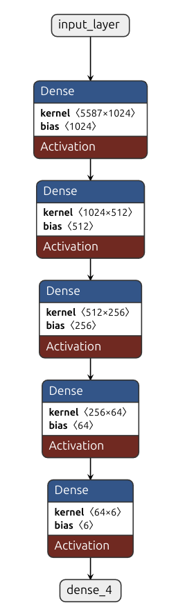

# Fully Connected Neural Network for Emotion Classification

## Overview
This project implements a fully connected neural network (FCNN) for emotion classification using the Emotion Dataset from Hugging Face. The model classifies text into six emotional categories: sadness, joy, love, anger, fear, and surprise.

## 📑 Table of Contents
- [Fully Connected Neural Network for Emotion Classification](#fully-connected-neural-network-for-emotion-classification)
  - [Overview](#overview)
  - [📑 Table of Contents](#-table-of-contents)
  - [📁 Project Structure](#-project-structure)
  - [📊 Dataset](#-dataset)
  - [🔍 Text Preprocessing](#-text-preprocessing)
  - [🧠 Model Architecture](#-model-architecture)
  - [⚙️ Training Details](#️-training-details)
  - [🚀 Installation](#-installation)
    - [Prerequisites](#prerequisites)
    - [Steps](#steps)
  - [🛠️ Usage](#️-usage)
    - [📥 Data Preparation](#-data-preparation)
    - [🏋️ Train the Model](#️-train-the-model)
    - [🔍 Test the Model](#-test-the-model)
  - [📈 Performance](#-performance)
  - [📋 Requirements](#-requirements)
  - [👥 Contributing](#-contributing)
  - [📄 License](#-license)
  - [🙏 Acknowledgments](#-acknowledgments)

## 📁 Project Structure
```
fully_connected_neural_network/
│
├── data/                  # Data directory
│   ├── train_data.parquet # Training data
│   ├── test_data.parquet  # Test data
│   └── validation_data.parquet # Validation data
│
├── model/                 # Model artifacts directory
│   ├── fcnn.keras         # Saved Keras model
│   ├── label_encoder.joblib # Serialized label encoder
│   └── vectorizer.joblib  # Serialized TF-IDF vectorizer
│
├── utils/                 # Utility modules
│   ├── __init__.py
│   ├── evaluate_and_save.py # Model evaluation and saving utilities
│   ├── preprocessing.py   # Text preprocessing functions
│   └── training_plot.py   # Training visualization utilities
│
├── explore_data.ipynb     # Notebook for EDA
├── data_preparation.py    # Script for data downloading and preprocessing
├── model_trainer.py       # Script for model training and evaluation
├── test_model.py          # Script for testing the model on new data
├── requirements.txt       # Project dependencies
└── README.md              # Project documentation
```

## 📊 Dataset
This project uses the [Emotion Dataset](https://huggingface.co/datasets/dair-ai/emotion) from Hugging Face, which contains text samples labeled with six emotions:
- 😢 Sadness
- 😄 Joy
- ❤️ Love
- 😠 Anger
- 😨 Fear
- 😲 Surprise

The dataset contains approximately 20,000 labeled text samples across training, validation, and test sets.

## 🔍 Text Preprocessing
The preprocessing pipeline includes:
- Lemmatization: Reducing words to their base form
- Lowercase conversion: Converting all text to lowercase
- Stop word removal: Removing common words that don't carry significant meaning
- Whitespace normalization: Standardizing spaces between words

The processed text is then vectorized using TF-IDF (Term Frequency-Inverse Document Frequency) vectorization, which converts the text into numerical features based on word importance.

## 🧠 Model Architecture
The model is a fully connected neural network with the following architecture:


- Input layer: TF-IDF vectorized text (sparse matrix converted to dense)
- Hidden layer 1: 1024 neurons with SELU activation and L2 regularization (0.01)
- Hidden layer 2: 512 neurons with SELU activation and L2 regularization (0.01)
- Hidden layer 3: 256 neurons with SELU activation and L2 regularization (0.01)
- Hidden layer 4: 64 neurons with SELU activation
- Output layer: 6 neurons with softmax activation (one per emotion)

The model uses the SELU (Scaled Exponential Linear Unit) activation function, which helps with self-normalizing properties and can lead to better convergence during training.

## ⚙️ Training Details
- Loss function: Categorical Cross Entropy
- Optimizer: Adam
- Learning rate: Starts at 0.001 with step decay (halves every 10 epochs)
- Class weights: Balanced using `compute_class_weight` to handle class imbalance
- Early stopping: Monitored on validation loss with a patience of 3 epochs
- Batch size: 256
- Maximum epochs: 20

## 🚀 Installation

### Prerequisites
- Python 3.8+
- pip package manager

### Steps
1. Clone the repository:
```bash
git clone https://github.com/yourusername/fcnn_en_US_emotion_classification.git

cd fcnn_en_US_emotion_classification

```

2. Create and activate a virtual environment (optional but recommended):
```bash
python -m venv venv
source venv/bin/activate  # On Windows, use: venv\Scripts\activate
```

3. Install dependencies:
```bash
pip install -r requirements.txt
```

4. Download the spaCy model (automatically done in preprocessing.py, but can be run separately):
```bash
python -m spacy download en_core_web_md
```

## 🛠️ Usage

### 📥 Data Preparation
Download and preprocess the dataset:
```bash
python data_preparation.py
```
This script will:
- Download the Emotion dataset from Hugging Face
- Process the text data (lemmatization, stop word removal, etc.)
- Save the processed data as parquet files in the `data/` directory

### 🏋️ Train the Model
Train the FCNN model on the preprocessed data:
```bash
python model_trainer.py
```
This script will:
- Load the preprocessed data
- Apply TF-IDF vectorization
- Train the model with the specified architecture and hyperparameters
- Display training plots showing loss curves
- Evaluate the model on the test set
- Save the trained model to `model/fcnn.keras`

### 🔍 Test the Model
Test the trained model on new text inputs:
```bash
python test_model.py
```
By default, this script tests the model with the text "Sometimes i get lost in my thoughts and i feel so scared". You can modify the `phrase` variable in the script to test with other text examples.

## 📈 Performance
The model's performance metrics (accuracy, precision, recall, F1-score) are evaluated on the test dataset and displayed after training. Typical performance for this architecture shows:

- Overall accuracy: ~85-90%
- Precision and recall vary by emotion class, with common emotions like joy and sadness typically having better metrics than less common ones like surprise



The confusion matrix helps visualize which emotions are most often misclassified and which ones the model predicts with highest confidence.

## 📋 Requirements
- Python 3.8+
- TensorFlow 2.19.0
- scikit-learn 1.6.1
- pandas 2.2.3
- numpy 2.1.3
- spaCy 3.8.4 (with 'en_core_web_md' model)
- matplotlib 3.10.1

## 👥 Contributing
Contributions to improve the model architecture, preprocessing, or add new features are welcome! Please feel free to submit a pull request.

1. Fork the repository
2. Create your feature branch (`git checkout -b feature/amazing-feature`)
3. Commit your changes (`git commit -m 'Add some amazing feature'`)
4. Push to the branch (`git push origin feature/amazing-feature`)
5. Open a Pull Request

## 📄 License
[MIT License](LICENSE)

## 🙏 Acknowledgments
- [dair-ai](https://github.com/dair-ai) for providing the emotion dataset
- [SpaCy](https://spacy.io/) for natural language processing utilities
- [TensorFlow](https://www.tensorflow.org/) and [Keras](https://keras.io/) for the deep learning framework
- [Scikit-learn](https://scikit-learn.org/) for machine learning utilities
- [Netron](https://github.com/lutzroeder/netron) for model visualization